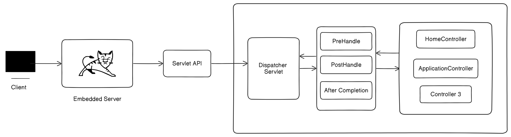
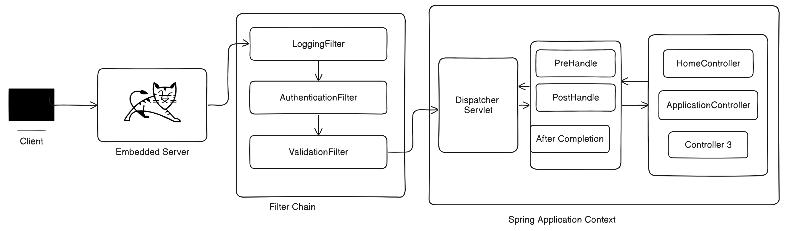

# 🍀Spring Security Architecture🔏

Wait!!👻🫸 Before diving deep into Spring Security architecture first we need to know about Filters in Spring.
## Filters in Spring🔎🔎
***
***Overview***
* What are Filters?
* Understanding the Filter Chain.
* Implementing a Custom Filter.
***

## ➡️ What are Filters?
> **🌿A filter is part of the [Servlet API](#-what-is-servlet-api). It sits between the client and our Spring Application.** <br>
_For Example it serves as a gatekeeper for our application. For each request they validate the request or perform some kind of operations on that filter._
<br>

***
***Here is a Diagram***


🥇 First our Service is deployed on the server like Tomcat/Jetty/UnderTow.  
🥈 Then Servlet API Handles request and responses. It typically responds to HTTP request coming from web browsers or REST clients.<br>
🥉 Then it goes to Spring application, we found Dispatcher Servlet. Which is basically abstraction of Servlet API. This Dispatcher Servlet sits inside the Spring core.
***

***
## Use Case of Filter 🪴
🔰 Logging request or response details  
🔰 Modification request or response details  
🔰 Authentication and authorization  
🔰 Request or input validation or modification  
🔰 CORS configuration  
***

## Understanding Filter Chain ⛓️
***
***What is Happening inside Servlet API***


🏫 From embedded server request goes to loggingFilter then it goes to AuthenticationFilter afterward it goes to ValidationFilter, because this is a filter chain⛓️ it gradually checks all the filter then it goes to Dispatcher Servlet.<br>
📔 Filter Chain in nothing but chain of filters which are running in sequential manner.
***

## Implementing a Custom Filter
***
**We can create Custom Filter if we want:**
```java
@component  // Marks this class as a Spring component so that Spring Boot can detect and register it as a bean
public class LoggingFilter implements Filter {
    @Override
    public void doFilter(ServletRequest servletRequest, 
                         ServletResponse servletResponse,
                         FilterChain filterChain) {
        
        // Cast the generic ServletRequest to HttpServletRequest to access HTTP-specific methods like getRequestURI().
        private HttpServletRequest httpServletRequest = (HttpServletRequest) ServletRequest;
        
        // Print the URI of the incoming request to the console (for logging/debugging purposes).
        System.out.println("Request URL: " + httpServletRequest.getRequestURI());
        
        // Continue the filter chain. This means the request is passed to the next filter (if any),
        // or to the target servlet/controller if there are no more filters.
        filterChain.doFilter(servletRequest, servletResponse);
    }
}
```
***

## Spring Security Architecture 🍀
***
Now we are jumping into about Spring Security Architecture:  

***Overview***
* What is Spring Security
* Authentication
* Authorization
* Architecture
***

## ➡️ What is Spring Security? 🔐
> 🌿 Spring Security helps protect APIs, WebApps and Microservices from unauthorized access, attacks and security threats.

***Key Features:***
***
1️⃣ Authentication - Verifies who the user is (e.g., login form, HTTP basic, JWT).  
2️⃣ Authorization - Determines what the user is allowed to do (e.g., role-based access).  
3️⃣ Password Encoding - Securely hashes and verifies user passwords.  
4️⃣ CSRF Protection - Prevents cross-site request forgery attacks.  
5️⃣ Session Management - Controls how user sessions are handled and protected.  
6️⃣ Security Filters - Uses a filter chain to apply security checks to every request.  
7️⃣ Method-level Security - Use annotations like `@PreAuthorize` and `@Secured` to secure specific methods.  

***
___Common Use Cases___:
* Protecting REST APIs.  
* Securing login/logout flows.  
* Managing roles like `ADMIN`, `USER`, etc.  
* Integrating with JWT, OAuth2, or LDAP.  
***

**Example:**  
___In a Spring Boot app, adding this following code to your `SecurityConfig` class can secure your endpoints:___

```java
import org.springframework.context.annotation.Bean;
import org.springframework.context.annotation.Configuration;
import org.springframework.security.config.annotation.web.builders.HttpSecurity;
import org.springframework.security.web.SecurityFilterChain;

@Configuration
public class SecurityConfig {

  @Bean
  public SecurityFilterChain securityFilterChain(HttpSecurity http) throws Exception {
    http
            .authorizeHttpRequests(auth -> auth
                    .requestMatchers("/admin/**").hasRole("ADMIN")
                    .anyRequest().authenticated()
            )
            .formLogin();

    return http.build();
  }
}
```

## What is Authentication? ✔️
> 🌿 **Authentication** is the process of verifying the identity of a user.  
In simpler terms, it's about answering the question:   
***who you are?***  
It ensures that user is legitimate before granting access.  

***In the Context of Web Applications:***
***
***Authentication is what happens when a user logs in with credentials like:***
* Username & Password
* JWT token
* OAuth token (Google, Facebook, etc.)
* API key  
**If the credentials are correct, the user is considered authenticated and allowed to access protected resources (depending on authorization rules).**
***

***Example in Spring Security:***
In a Spring Boot app, adding this to your `SecurityConfig` class can secure your endpoints:
```java
httpSecurity
        .authorizeRequests()
        .anyRequest().authenticated()
        .and()
        formLogin();
```
*** 
***Spring Security will:***
1. Show the login page.
2. Take the username/password
3. Authenticate the user (using `UserDetailsService`).
4. Store user details in the session.
***

## What is Authorization?  
## 🕵️💂‍♀️🥷👷‍♀️👩‍⚕️👩‍🎓👩‍🏫👨‍⚖️👨‍🌾👨‍🍳👨‍🏭👨‍🔬👨‍🎤👨‍✈️👨‍🚒🤵‍♀️🤱
> 🌿 Authorization is the process of determining what an authenticated user is allowed to do.  
> It answers the question:  
> ___"What can you access?"___  

While **Authentication** confirms identity (e.g., you are "admin@example.com"),
**authorization** checks what permissions or roles you have (e.g., you can delete users, but not access financial records).

***Example in Spring Security:***  
Suppose you want only users with the role `ADMIN` to access the `/admin` endpoint.
```java
    http
        .authorizeHttpRequests(auth -> auth
        .requestMatchers("/admin/**").hasRole("ADMIN")
                    .anyRequest().authenticated()
            )
                    .formLogin();

    return http.build();
```
Here:
* If a user is authenticated but does not have the `ADMIN` role, access will be denied.
* Authorization check what happens after authentication is successful.

***Common Types of Authorization:***
***
* Role-based access control (RBAC) - e.g., roles like `USER`, `MODERATOR`, `ADMIN`.
* Permission-based access control - fine-grained control (e.g. `CAN_EDIT_USER`).
* Method-level authorization - annotations like:
***

```java
@PreAuthorize("hasRole('ADMIN')")
public void deleteUser(Long id) {
    ...
}
```
# Spring Security Architecture 🔐

## DelegatingFilterProxy 🍀
> Spring provides a `Filter` implementation named `DelegatingFilterProxy` that allows bridging between the Servlet container's lifecycle and Spring's ApplicationContext.
> The Servlet container allows registering `Filter` instances by using its own standards, but it is not aware of Spring-defined Beans.
> We can register `DelegatingFilterProxy through` the standard Servlet container mechanism but delegate all the work to a Spring Bean that implements `Filter`.  
  <br>
  <br>


***
_When we add Spring Boot Starter Security dependency then a `SecurityFilterChain` get added. This happens when we add support for spring security.
Servlet API has separate lifecycle and Spring Bean's have separate life cycle too. We want bridge between these two. 
So, we want to connect our Servlet API lifecycle to our Spring application context. That is when `DelegatingFilterProxy` comes into picture._  

***Image of `DelegatingFilterProxy` connecting From Servet to Application***  

***

## FilterChainProxy 🌿
> Spring Security's Servlet support is contained within `FilterChainProxy`. 
> `FilterChainProxy` is a special `Filter` provided by Spring Security that allows delegating to many `Filter` instances through `SecurityFilterChain`.  
> Since `FilterChainProxy` is a Bean, it is typically wrapped in a `DelegatingFilterProxy`.

***The Following image shows the role of `FilterChainProxy`***.  


_So We have several filter connecting from client to servlet like this. One of the filter is `DelegatingFilterProxy` which has `FilterChainProxy` implements `SecurityFilterChain` like this._  
_`FilterChainProxy` is a special filter that will be added inside our `DelegatingFilterProxy` and this have `SecurityFilterChain` and this all in our happening inside our`FilterChain`._

## SecurityFilterChain 🍁
> `SecurityFilterChain` is used by `FilterChainProxy` to determine which Spring Security `Filter` instances should be invoked for the current request.

> The Security Filters in `SecurityFilterChain` are typically Beans, but they are registered with `FilterChainProxy` instead of `DelegatingFilterProxy`. 
> `FilterChainProxy` provides a number of advantages to registering directly with the Servlet container or `DelegatingFilterProxy`.
> First, it provides a starting point for all of Spring Security's Servlet support.
***
The following image shows the role of `SecurityFilterChain`.  
<br>

***

_Our `FilterChain` have `FilterChainProxy` Which will have `SecurityFilterChain`. In `SecurityFilterChain` there will be multiple Security Filters. Starting from filter<sub>0</sub> to Filter<sub>n</sub> .
`DelegatingFilterProxy` and `FilterChainProxy` is abstract for us. We rather use `SecurityFilterChain` directly when we try to log in using username and password._  
***
***Here is a Picture of `SecurityFilterChain` reside in `FilterChain`***

***

## AuthenticationProvider 🍃
> In Spring Security, an `AuthenticationProvider` is a core interface used to perform **authentication logic**. 
> It is responsible for verifying the credentials (like username and password) provided in an authentication request and returning a fully authenticated object if the authentication is successful.

### Interface Definition
```java
public interface AuthenticationProvider {
    Authentication authenticate(Authentication authentication) throws AuthenticationException;
    boolean supports(Class<?> authentication);
}
```

### How it Works
1. `authenticate()`:  
  * Takes an `Authentication` object (e.g., `UsernamePasswordAuthenticationToken`) that contains credentials.
  * Validates the credentials (e.g., matches with the password).
  * If valid, returns an authenticated `Authentication` object with user details and roles.
  * If invalid, throws and `AuthenticationException`.

2. `supports()`:  
  * Determines whether this provider supports the given `Authentication` class.

## Common Implementations:  🥬
1. `DaoAuthenticationProvider` Example: 🍅

Spring Security provides a built-in-implementation called `DaoAuthenticationProvider` which is used with `UserDetailsService`:

```java
@Bean
public AuthenticationProvider authenticationProvider() {
    DaoAuthenticationProvider provider = new DaoAuthenticationProvider();
    provider.setUserDetailsService(userDetailsService);
    provider.setPasswordEncoder(passwordEncoder);
    return provider;
}
```
* `UserDetailsService`: Loads user data from DB.
* `PasswordEncoder`: Verifies encrypted passwords.


2. `LdapAuthenticationProvider`
  * Used for LDAP-based authentication(e.g., Corporate Active Directory).
  * Connects to LDAP servers to fetch and validate user credentials.

3. `JwtAuthenticationProvider` (not built-in but common in JWT setups)
  * Custom implementations for JWT token-based authentication.
  * Validates JWT tokens and extracts user information.

Spring Security doesn't provide this out-of-the-box--you write a custorm provider or use filters.

4. `CasAuthenticationProvider`
  * For CAS (Central Authentication Service) integration.
  * Used in SSO (Single Sign-On) setups.

5. `OpenIDAuhtenticationProvider` (Deprecated)
  * Used for OpenID-based authentication (now largely replaced by OAuth2 / OIDC).
  * Deprecated in favor of more modern standards.

6. `OAuth2LoginAuthenticationProvider`:
  * Handles **OAuth2 login** (e.g., Google, Facebook).
  * Used internally in Spring Security when you configure `.oauth2login()`.

7. `Saml2AuthenticationProvier`:
  * Supports SAML 2.0 protocol for enterprise-level SSO authentication.
  * Often used with identity providers like Okta, ADFS.

### Custom `AuthenticationProvider` Example: 🥕
_If we want custom authentication logic (e.g., token-based login):_
```java
@Component
public class CustomAuthenticationProvider implements AuthenticationProvider {
    
    @Override
  public Authentication authenticate (Authentication authentication) throws AuthenticationException {
        String username = authentication.getName();
        String password = authentication.getCredentials().toString();
        
        // Custom logic (e.g., checking from database or external service)
      if("admin".equals(username) && "secret".equals(password)) {
          return new UsernamePasswordAuthenticationToken(username, password, List.of(new SimpleGrantedAuthority("ROLE_USER")));
      } else {
          throw new BadCredentialsException("Authentication failed");
      }
    }
    
    @Override
    public boolean supports(Class<?> authentication) {
        return UsernamePasswordAuthenticationToken.class.isAssignableFrom(authentication);
    }
}
```

You register it in the security config using:

```java
http.authenticationProvider(customAuthenticationProvider);
```

You can define your own if the built-in ones don't meet your needs:
  * Token-based systems
  * SMS/email OTP
  * Biometric verification


When we try to log in we need to give username and password. Initially username and password is generated by Spring.
This generated username and password is for development purpose only. We should not use in production.  
When we use in production then we should make use any of the `AuthenticationProvider` we discussed earlier.

Some of the common authentication is OAuth2, JWT, and LDAP.  
For each of the authentication like InMemory, OAuth2, LDAP Spring provide own `AuthenticationProvider`.
***
***Here is a Image to relate with AuthenticationProvider***  


<br>

Inside `SecurityFilterChain`, `UsernameAndPasswordAuthenticaitonFilter` resides.  
`UsernameAndPasswordAuthenticationFilter` delegates our request to respective `AuthenticationProvider` which will authenticate request for us.  
Now **How Spring Boot knows which authentication to provide for each filter?**  
In order to solve this problem Spring has introduced authentication manager.
***

## `AuthenticationManager` 👨‍💼
> The `AuthenticationManager` is the **core interface** in Spring Security used to process **authentication reqeusts**.

```java
public interface AuthenticationManager {
    Authentication authenticate(Authentication authentication) throws AuthenticationException;
}
```
It receives an `Authentication` object (usually containing username and password), and it returns a **fully authenticated** object if credentials are valid -or throws an exception if not.

## `ProviderManager` 🔫
### RelationShip:
* `ProviderManager` is the **default implementation** of the `AuthenticationManager` interface.
* It acts as a **delegator** to one or more `AuthenticationProvider`s.

### What does `ProviderManager` Do?
When the `authenticate()` method is called on `ProviderManager`, it:
1. **Loops through all registered** `AuthenticationProvider`s.
2. For each provider, it checks:
```java
provider.supports(authentication.getClass())
```
This decides if that provider can handle the given authentication token type.
3. If supported, it calls:
```java
result =  provider.authenticate(authentication)
```
If the result is not null and authenticate, it returns that result.
4. If no provider can authenticate, it throws an `AuthenticationException`.

## Is `ProviderManager` inside `AuthenticationManager`?
Not exactly - instead:
> `ProviderManager` is an implementation of the `AuthenticationManager` interface.

So, wherever we see `AuthenticationManager`, it's often referring to an instance of `ProviderManager`.

### Interface-Implementation Relationship
```java
public interface AuthenticationManager {
    Authentication authenticate(Authentication authentication) throws AuthenticationException;
}
```
```java
public class ProviderManager implements AuthenticationManager {
    private List<AuthenticationProvider> providers;
    ...
}
```

### So How does it work?
When we do something like this:

```java
@Bean
public AuthenticationManager authenticationManager(UserDetailsService userDetailsService, PasswordEncoder encoder) {
    DaoAuthenticationProvider provider = new DaoAuthenticationProvider();
    provider.setUserDetailsService(userDetailsService);
    provider.setPasswordEncoder(encoder);
    
    return new ProviderManager(List.of(provider)); // This is our AuthenticationManager
}
```
We are returning a `ProviderManager` instance, which implements the `AuthenticationManager` interface.

### Remember
* `AuthenticationManager` is just a contract.
* `ProviderManager` is the **main class** that fulfills that contract.
* It holds a list of `AuthenticationProvider`s to handle different kinds of authentication.

So, When Spring Security needs to Authenticate a request, it calls:
```java
authenticationManager.authenticate(authentication);
```
under the hood, this is really:
```java
providerManager.authenticate(authentication); // delegating to providers
```
***
***Image of AuthenticationManager***

***

_`ProviderManager` loop through each of the `AuthenticationProvider` and check which one support the incoming request.  
if it supports then it delegates the tasks to that particular  `AuthenticationProvider`._

Now, ***How our AuthenticationProvider is retrieve the information form database?***
In order to solve this problem spring has a solution it call `UserDetailsService`.

## What is `UserDetailsService`? 👤
`UserDetailsService` is an **interface** provided by Spring Security to **retrieve user-related data**.  
It is used during the **authentication process** to load user-specific data (such as username, password, and authorities/roles).

***Interface Definition:***
```java
public interface UserDetailsService {
    UserDetails loadUserByUsername(String username) throws UsernameNotFoundException;
}
```

***Method Explanation:***
* `loadUserByUsername(String username)`:
  This method is called automatically by Spring Security when someone tries to log in.  
  Our job is to **implement this method** to fetch the user (usually from a database) and return an object to type `UserDetails`.

***Image of How `UserDetailsService` working?***


### What is `UserDetails`? 👤

It's another interface that contains user info like:
  * `getusername()`
  * `getPassword()`
  * `getAuthorities()` (roles/permissions)
  * `isAccountNonExpired()`
  * `isAccountNonLocked()`, etc.

***
***A Brief Overview of How Everything works?***


>Now Authentication connects to `UserDetailsService` which will actually connect to our database and fetch the user information and return it to user interface.  
`UserDetailsService` sends back the information to the `AuthenticationProvider` to evaluate username and password.

>We directly don't put password values into our database. So we encode and save it.  
That encoded password need to convert it to normal value so it can compare to our actual password.
That is why password encoder comes into picture. It is part of the `AuthenticationProvider`.  
After decoding it will evaluate the password from our incoming request and return the decoded to password.  
<br>
After that `AuthenticationProvider` returns object of authentication to `AuthenticationManager` and it returns to our filter.

>The authentication object(username/password) needs to be stored somewhere so other part of Spring application is able to access it and check all the details of our authentication.
So that all the other beans can access it too and verify successful authentication.

The **Solution is `SecurityContext`**.
***

## What is `SecurityContext`? ♦️
> `SecurityContext` is a **container** that holds the **security information** of the currently authenticated user.
* It stores the `Authentication` object, which contains:
  * Principal (usually the logged-in `UserDetails`)
  * Credentials (usually the password - cleared after auth)
  * Authorities (roles/permission)
  * Authentication status
  
***Where is it stored?***
Spring Security stores the `SecurityContext` in a `ThreadLocal` storage via a helper class called `SecurityContextHolder`.
This means:
  * Each thread has its own copy of the security context.
  * It is automatically propagated for HTTP requests.

***Lifecycle of `SecurityContext`***
1. User Logs in (form-based, JWT, OAuth, etc.)
2. On successful login, an `Authentication` object is created and stored in the `SecurityContext`.
3. `SecurityContextHolder.setContext(...)` is called internally.
4. We can access the current user's details from anywhere in the app using:

```java
Authentication auth = SecurityContextHolder.getContext().getAuthentication();
```

***Example: Get Current User***
```java
public String getCurrentUsername() {
    Authentication authentication = SecurityContextHolder.getContext().getAuthentication();

    if (authentication != null && authentication.getPricipal() instanceof UserDetails) {
        UserDetails userDetails = (UserDetails) authentication.getPrincipal();
        return userDetails.getUsername();
    }

    return null;
}
```

`SecurityContext` abstraction also stores principal object. In order to access that inside Spring Boot Application It is called `SecurityContextHolder`.  
The `SecurityContextHolder` has method like getContext(). Which will return us the authentication or principal object.

`SecurityContextHolderFilter` remembers our authenticated request. Next time when we want to load it again it says we are already authenticated you don't need to do all this again and again.

**What if Something goes wrong?**  
_What is we give the wrong password?_  
_What if `UserDetailsService` not able to get user details from the database?_  

Then `ExceptionTranslationFilter` comes into picture. It's job is to catch all the exception error or Authentication failure then it throws respective error to client.


## 🤷‍♂️🤷 What is Servlet API?
A **Servlet** is a Java class that runs on **Servlet container** (like tomcat) and responds to HTTP request -- typically from web browsers or REST clients.

Think of it as the "middleman" between a client and our server-side business logic.

## Core Concepts of Servlet API
* `HttpServletRequest`: Represents the client's request. Includes headers, parameters, body, etc.
* `HttpServletResponse`: Represents the response to send back to the client.
* `Filter`: Intercepts requests before they reach a servlet (e.g., for logging, security).
* `ServletContext`: Global data shared across the app (e.g., config).
* `HttpSession`: Manages user-specific session data across multiple requests.

## Lifecycle of a Servlet
1. Initialization -- Called once (like a constructor).
2. Service -- Called for every request.
3. Destroy -- Called when the servlet is taken down.

## Example Servlet (without Spring)
```java
@WebServlet("/hello")
public class HelloServlet extends HttpServlet {
  protected void doGet(HttpServletRequest req, HttpServletResponse response) throws IOException {
    response.getWriter().write("Hello, Servlet API!");
  }
}
```

## How Spring Boot Uses the Servlet API
Spring Boot runs on top of the Servlet API and uses it **behind the scenes:**
* Controllers in Spring use `HttpServletRequest` and `httpServletResponse`.
* Filters (like `OncePerRequestFilter`) are built on Servlet Filters.
* The entire DispatcherServlet mechanism in Spring MVC is a Servlet.


